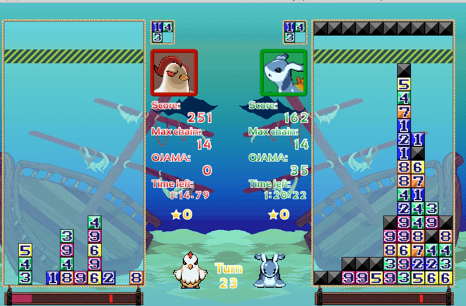

### RustでゲームAIコンテストに出た話
----------------------
Rust LT5 2019/05/27(@togatoga_)
---
#### About Me
* togatoga
  * [GitHub: https://github.com/togatoga](https://github.com/togatoga)
  * [Twitter: https://twitter.com/togatoga_](https://twitter.com/togatoga_)
* 仕事はC++, Python
* Rust歴は約3ヶ月
---
#### CODEVS Rebornとは

---
#### CODEVS Reborn(ゲームルール)
* お題は落ちものパズルゲーム
* 連鎖すると相手にお邪魔ブロックが相手の盤面に降る
  * 相手の盤面を先にブロックで埋めたほうが勝利
  * 連鎖が大きいほど相手盤面に降るお邪魔ブロックの数は多くなる
* AIは制限時間内ブロックを落とす行動を出力する
  * 1手20秒
  * 合計3分の持ち時間
---
#### CODEVS Reborn(予選・決勝)
* 予選
  * 2019/04/15 ~ 2019/05/10
  * 上位八名が決勝トーナメントに進出
* Rustで参加して決勝トーナメントに進出しました
  * 決勝は一回戦敗退
  * プログラマ日本一決定戦再び！CODE VS Reborn(2019/05/25)
    * ニコ生: https://live.nicovideo.jp/gate/lv320076507
---
#### CODEVS Reborn(ゲームAIで必要なこと)
* プログラムに何手か先までシミュレーションして大連鎖する行動を探索させる
* (個人的な)ゲームAIに適した言語の条件
  * 言語自体が十分に高速であること
    * 多くの盤面を計算でき良い手がみつかる可能性が高い
  * バグらせにくいこと
    * シミュレータは実装量が多く高速化が必須なためバグを埋め込みやすい
    * バグで弱いのかAI自体が弱いかの判断が難しい
---
#### CODEVS Reborn(Rust提出)
* 運営のサーバー上でプログラムを実行する必要がある
  * ソースコードを提出して運営サーバー(Ubuntu 18.04 LTS)上で実行される
* サポート言語
  * Java, C++, C#, Ruby, Python
  * zip提出
    * 複数ファイルを提出するためにサポート
---
#### CODEVS Reborn(zip提出)
* zip提出で実行されるコマンド
```bash
find -name "*.sh" --exec bash {}
```
* プログラムを運営サーバーで実行できさえすればよい
  * クロスコンパイルしてバイナリファイルを運営サーバーに提出
    * musl

```bash
% cargo build --release --target=x86_64-unknown-linux-musl
% cat -p run.sh
#!/bin/sh
SCRIPT_DIR=`dirname $0`
$SCRIPT_DIR/togatog_ai
```
---
#### Rustを使って良かった点 #1
* 高速
  * Rustが十分高速なためコンテスト中はアルゴリズムの高速化に集中できた
* テスト
  * シミュレータのテストが書きやすく、コンテスト終盤でも安心して改善案を実装できた
---
#### Rustを使って良かった点 #1(テスト例)
```rust
#[test]
fn test_simulate() {
    //盤面の状態
    let mut board = board::Board::new(raw_board);
    //落とすブロックの情報
    let pack = pack::Pack::new(&[7, 6, 6, 9]);
    //ブロックを落とすポイントを指定して実際に落とす
    let chain_count = Simulator::new().simulate(&mut board, 6, &pack);
    let score = CHAIN_CUMULATIVE_SCORES[chain_count as usize];
    //「得たスコア」と「シミュレーション後の連鎖数」
    debug_assert_eq!((score, chain_count), (120, 13));
}
```
---
#### Rustを使って良かった点 #2
* 潜在的なバグを見つけやすい & 防ぎやすい
  * コンパイル時の未使用変数の警告でバグが発覚
  * debug releaseで評価関数のオーバーフローを発見
* 外部ライブラリの導入コストが低い
```bash
#Cargo.toml
[dependencies]
clap = "~2.33"
csv = "1"
serde_derive = "1.0.90"
min-max-heap = "1.2.2"
fnv = "1.0.3"
[dev-dependencies]
criterion = "0.2"
```
---
#### Rustを使って気になったところ
* コンテスト序盤はコンパイルを通すのに苦労した
  * コードを書く時間よりRustのドキュメントを読んでる時間のほうが長かった
* 改善案やプロトタイプの実装に時間がかかった
  * 暗黙の型変換
  * 異なる型での演算(usize + u8)
  * 所有権
---
#### 最後に
* CODEVS Reborn決勝進出者の使用言語
  * C++(4人), Java(2人), Rust(2人)
  * 優勝者はRustを使用
    * 歴代優勝者は全員C++(のはず)
* 決勝一回戦で優勝者と当たり敗北(1-3)
  * 大会後、準優勝の人(C++)と101本先取
  * 101 - 83で勝利
* ゲームAIの分野でもRustが今後採用されていくと予想しています
  * CODEVSは来年も開催される予定なのでぜひRustで参加してください！！
